# Roteiro 1 - Cloud Computing

## Introdução

Este roteiro tem como principais objetivos:

* Entender os conceitos básicos sobre uma plataforma de gerenciamento de hardware
* Introduzir conceitos básicos sobre redes de computadores

O *Metal-as-a-Service* (MaaS) é uma solução de gerenciamento de infraestrutura que trata servidores físicos como máquinas virtuais na nuvem. Ele permite provisionar, gerenciar e controlar servidores físicos através de uma interface web amigável, tornando possível implantar sistemas operacionais rapidamente e gerenciar infraestruturas complexas de forma centralizada.

### Pré-requisitos
* Realizar a leitura sobre o MaaS: [https://maas.io/]
* Familiaridade básica com conceitos de redes e virtualização

### Material do Kit
O grupo contará com os seguintes itens:

* 1 NUC (main) com 10GB e 1 SSD (120GB)
* 1 NUC (server1) com 12GB e 1 SSD (120GB)
* 1 NUC (server2) com 16GB e 2 SSD (120GB+120GB)
* 3 NUCs (server3, server4 e server5) com 32GB e 2 SSD (120GB+120GB)
* 1 Switch DLink DSG-1210-28 de 28 portas
* 1 Roteador TP-Link TL-R470T+

### Configuração de Rede
Cada grupo tem à disposição um ponto de rede (cabo preto) com saída para a rede interna da faculdade, e cada kit possui um IP de entrada que pode ser verificado no dashboard do roteador.

### Política de Senhas
Todas as senhas do sistema devem seguir o critério:

* Utilizar a palavra 'cloud' + a letra do kit minúscula
* Por exemplo: 'cloudz' para o kit Z
* Usar a mesma senha para todos os serviços que exigem cadastramento
* NÃO alterar nenhuma senha que já esteja pré-cadastrada

Para o nosso caso, as senhas eram `cloudm`.

## Parte 1: Infraestrutura

### Instalando o Ubuntu

Procure tutoriais de como instalar o Sistema Operacional **Ubuntu server**, utilize um pen drive para baixar a imagem e criar um pendrive para boot da instalacao.

  * Instale o Ubuntu Server 22.04 LTS na NUC main:
    * hostname: main
    * login: cloud
    * senha: (cloud + letra do kit)
    * IP fixo: **172.16.0.3**
    * Name Servers (DNS): **172.20.129.131**

### Instalando o MaaS

  * O MAAS possui diversas versões, iremos utilizar a "stable" 3.5.3 [link para visualizar o time line](https://launchpad.net/maas/+series)
  * Verifique se consegue pingar '8.8.8.8'. Se não conseguir, descubra como rotear os pacotes corretamente.
  * Verifique se consegue pingar 'www.google.com'. Se não conseguir, descubra como resolver as urls corretamente.
  * ```$ sudo apt update && sudo apt upgrade -y```
  
  * ```$ sudo snap install maas --channel=3.5/stable```

  * ```$ sudo snap install maas-test-db```

Para acessar nossa máquina remotamente, fazemos o acesso utilizando o ssh.

```ssh cloud@172.16.0.3```


### Configurando o MaaS

  * Inicializando o MaaS:
    * ```$ sudo maas init region+rack --maas-url http://172.16.0.3:5240/MAAS --database-uri maas-test-db:///```
    * ```$ sudo maas createadmin```
      * use o login **cloud**
      * use a senha padrão da disciplina
      * deixe a chave vazia
  * Gerando um par de chaves para autenticação.
    * ```$ ssh-keygen -t rsa```
    * use senha vazia dessa vez
    * ```$ cat ./.ssh/id_rsa.pub```
    * copie a chave gerada

Primeiramente, precisamos entender onde o serviço está rodando e fazer login.

1. Configure um DNS Forwarder com o DNS do Insper (DNS Externo que o seu roteador enxerga)
    * Acesse `Settings > DNS`
    * Coloque o DNS do Insper: `172.20.129.131`

2. Importe as imagens do Ubuntu
    * Em `Configuration > Images`
    * Selecione Ubuntu 22.04 LTS com arquitetura amd64
    * Selecione Ubuntu 20.04 LTS com arquitetura amd64 (clique em "Update Selection")
    * Clique em "Continue" sem mexer em "Other Images"
    * Finalize com "Save and Finish Setup"

3. Faça o upload da chave SSH
    * Copie a chave pública do seu terminal SSH
    * Inclua todo o conteúdo, desde `ssh-rsa` até o final com `cloud@main`
    * Em Source, escolha "Upload"

4. Configure os parâmetros do kernel
    * Em `Settings > General`
    * Global Kernel Parameters: `net.ifnames=0` (sem espaços)

### Configuração do DHCP

1. Habilite o DHCP na subrede pelo MaaS Controller
    * Acesse `Subnets` no dashboard
    * Clique em `VLAN` em "untagged"
    * Selecione "Configure DHCP"
    * Selecione o Rack controller como "main"
    * Coloque a subnet criada (172.16.0.0/20)
    * Clique em "Configure DHCP"
    * Confirme clicando em "OK"

2. Altere o Reserved Range
    * Configure para iniciar em `172.16.11.1` e terminar em `172.16.14.255`
    * Este range ficou configurado como dinâmico

3. Configure o DNS da subnet
    * Mantenha apontando para o DNS do Insper
    * Acesse `Subnet > IP subnet > Edit`

4. Desabilite o DHCP no roteador
    * Acesse o IP do roteador: `172.16.0.1`
    * Navegue até `Network > LAN > DHCP Server`
    * Altere o status para "Disable"
    * Salve as alterações

### Verificação da Saúde do MaaS

Confirme a saúde do sistema MaaS:

1. Visite a página "Controllers" na interface web (dashboard)
2. Selecione o nome do controlador
3. Certifique-se de que a página mostre uma marca de seleção verde ao lado dos itens 'regiond' até 'dhcpd'

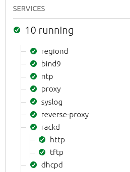

### Comissionamento de Servidores

1. Cadastre os hosts (machines) disponíveis, do server1 até server5
    * Altere a opção Power Type para Intel AMT e preencha conforme abaixo:
    * MacAddress: utilize o que foi anotado anteriormente
    * Senha: `CloudComp6s!`
    * IP do AMT: `172.16.15.X` (sendo X o id do server, por exemplo server1 = 172.16.15.1)

2. As NUCs irão comissionar automaticamente via boot PXE na rede

3. Verificação das características de hardware:
    * Server1: Características a serem observadas
    * Server2: 248,1GB no storage e 32GB de RAM
    * Server3: 248,1GB no storage e 31GB de RAM
    * Server4: 240,1GB no storage e 32GB de RAM
    * Server5: 240,1GB no storage e 32GB de RAM

4. Confirme que todos os nós aparecem com o status Ready
    * Verifique se as características de hardware (cpu, memória, SSD e rede) foram detectadas corretamente

### Adicionando o Roteador como Device

1. Acesse `Devices > Add Device`
2. Configure:
    * Device Name: Roteador
    * MAC Address: utilize o endereço do roteador
    * Para encontrar o MAC Address acesse `Dashboard do Roteador > Network > MAC > Current MAC Address` (na linha de LAN)
3. Clique em "Save device"

### Criando OVS Bridge

Uma Open vSwitch (OVS) bridge reduz a necessidade de duas interfaces de rede físicas.

Para cada servidor, execute este procedimento:

1. Acesse `Machines`
2. Selecione cada servidor individualmente
3. Navegue até `Network`
4. Selecione a interface `eth0`
5. Clique em "Create bridge"
6. Mude o nome para `br-ex`
7. Coloque Bride Type como `Open vSwitch (OVS)`
8. Sete o `Auto-Assign`
9. Clique em "Save interface"

O nome da ponte será referenciado em outras partes dos roteiros. Neste exemplo de nuvem, utilizamos uma única VLAN não etiquetada.

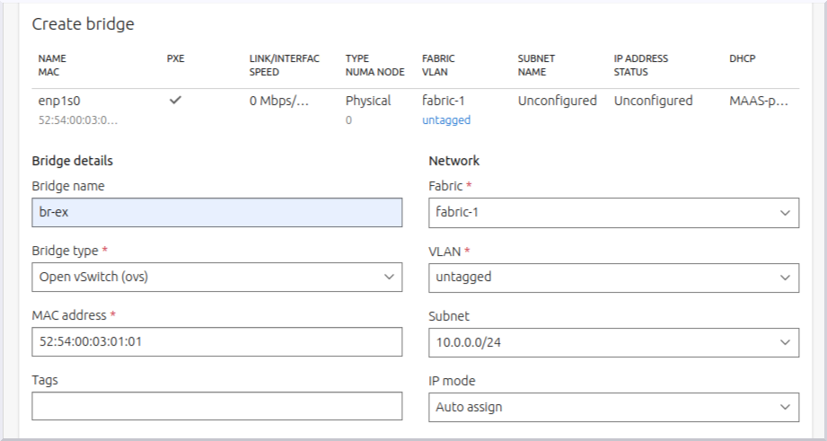

### Configurando Acesso Remoto

Vamos realizar um NAT para permitir o acesso externo da "Rede Wi-fi Insper" ao servidor MAIN.

1. Crie uma regra NAT para acesso SSH:
    * Acesse `Dashboard do roteador > Transmission > NAT > Virtual Servers > Add`
    * Configure portas interna e externa como 22
    * O IP é o da NUC main: `172.16.0.3`
    * A rede `0.0.0.0/0` representa "libere o acesso sempre"

2. Libere o acesso ao gerenciamento remoto do roteador:
    * Acesse `Dashboard do Roteador > System Tools > Admin Setup > Remote Management`
    * Configure o IP como `0.0.0.0/0`
    * Status: Enable

3. Registre os IPs importantes:
    * IP FIXO DO ROTEADOR (EXTERNO): `10.103.1.22` (IP que o Insper enxerga)
    * IP INTERNO DO ROTEADOR: `172.16.0.1`

4. Crie uma regra NAT para o MaaS:
    * Configure de forma similar ao SSH, mas usando a porta 5240
    * IP continua sendo o da NUC main: `172.16.0.3`

#### Endereços IP Relevantes

Para referência e configurações futuras, registre os seguintes endereços:

| Descrição | Endereço | Observação |
|-----------|----------|------------|
| IP externo do roteador | `10.103.1.22` | IP fixo visível pela rede do Insper |
| IP interno do roteador | `172.16.0.1` | Gateway da rede interna |
| Porta do serviço MaaS | `5240` | Porta fixa do serviço |
| IP da NUC main | `172.16.0.3` | Servidor principal |

Após estas configurações, é possível acessar tanto o roteador quanto o serviço MaaS a partir de qualquer ponto conectado à rede do Insper, eliminando a necessidade de conexão física direta. O roteador atua como intermediário, redirecionando as requisições externas para os serviços internos apropriados.

Agora é possível acessar o roteador de qualquer lugar do Insper pelo seu IP externo.


## Parte 2: Aplicação

### Django em Nuvem Bare-Metal

#### Ajuste no DNS Server

Antes de começar, realize um pequeno ajuste no DNS server:

1. Dentro da aba Subnets, clique na subnet `172.16.0.0/20`
2. Edite a Subnet summary colocando o DNS do Insper: `172.20.129.131`

#### Implantação do Banco de Dados (PostgreSQL)

1. Acesse o Dashboard do MaaS e realize o deploy do Ubuntu 22.04 no server1
    * Navegue até `Machines > Server1 > Actions > Deploy > Deploy Machine`

2. Acesse o terminal do server1 via SSH:
   ```bash
   ssh ubuntu@172.16.15.13  # IP_DO_SERVER1
   ```

3. Instale o PostgreSQL:
   ```bash
   sudo apt update
   sudo apt install postgresql postgresql-contrib -y
   ```

4. Crie um usuário para a aplicação:
   ```bash
   sudo su - postgres
   createuser -s cloud -W
   # Use a senha: cloud
   ```

5. Crie um database para a aplicação:
   ```bash
   createdb -O cloud tasks
   ```

6. Configure o PostgreSQL para aceitar conexões remotas:
   ```bash
   nano /etc/postgresql/16/main/postgresql.conf
   ```
    * Remova o comentário e substitua a linha para aceitar conexões remotas:
   ```
   listen_addresses = '*'
   ```

7. Configure o acesso:
   ```bash
   nano /etc/postgresql/16/main/pg_hba.conf
   ```
    * Adicione a linha que libera máquinas dentro da subnet do kit:
   ```
   host    all    all    172.16.0.0/20    trust
   ```

8. Saia do usuário postgres com o comando `exit`

9. Libere o firewall:
   ```bash
   sudo ufw allow 5432/tcp
   ```

10. Reinicie o serviço:
    ```bash
    sudo systemctl restart postgresql
    ```


!!! Tarefa-1

    Estude os comandos ping, ifconfig, systemctl, telnet, ufw, curl, wget e journalctl. Com estes comandos apresente prints das Telas  que provam que o banco de dados está:
    
        1. Funcionando e seu Status está como "Ativo" para o Sistema Operacional
        2. Acessivel na própria maquina na qual ele foi implantado.
        3. Acessivel a partir de uma conexão vinda da máquina MAIN.
        4. Em qual porta este serviço está funcionando.

##### 1. Funcionando e seu Status está como "Ativo" para o Sistema Operacional.
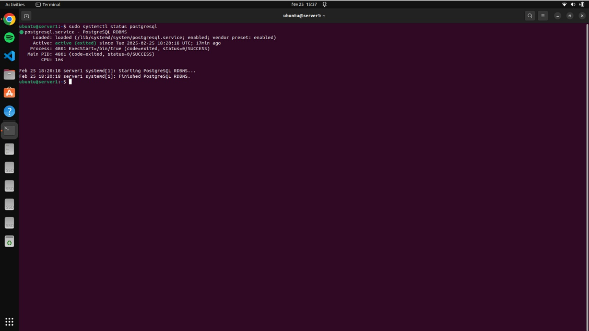

##### 2. Acessivel na própria maquina na qual ele foi implantado.
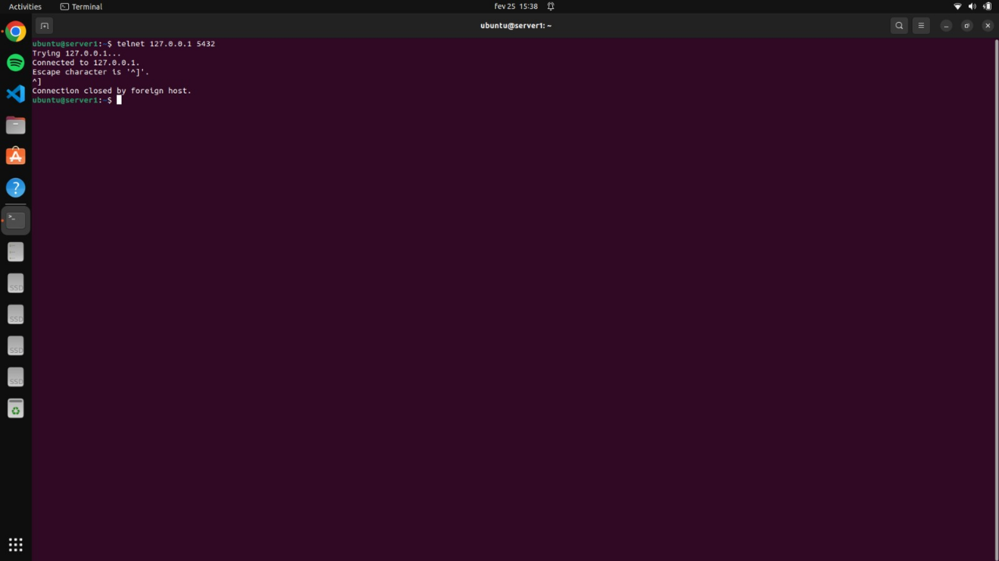

##### 3. Acessivel a partir de uma conexão vinda da máquina MAIN.
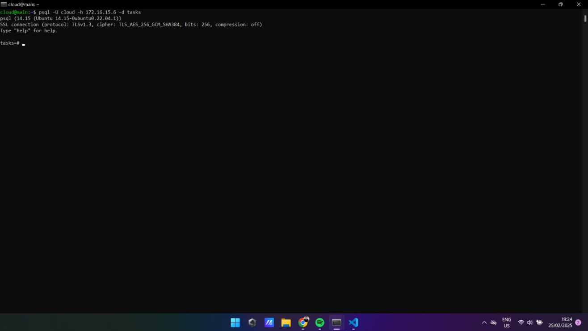

##### 4. Em qual porta este serviço está funcionando.
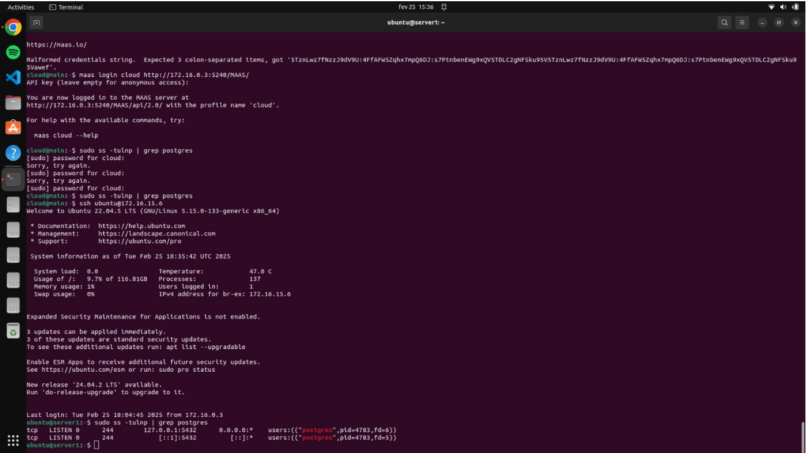

### Implantação da Aplicação Django

1. Volte ao MaaS e solicite uma máquina via CLI:
   ```bash
   maas login cloud http://172.16.0.3:5240/MAAS/
   ```
    * Busque o token no dashboard dentro das configurações do usuário: `Cloud > API Keys`

2. Solicite a reserva da máquina para o MaaS:
   ```bash
   maas cloud machines allocate name=server2
   ```
    * Anote o system_id do JSON resultante (no nosso caso: `ew8g34`)

3. Realize o deploy via linha de comando:
   ```bash
   maas cloud machine deploy ew8g34
   ```

4. Após o deploy, acesse o servidor via SSH (IP: `172.16.15.14`):
   ```bash
   ssh ubuntu@172.16.15.14
   ```

5. Clone o repositório da aplicação:
   ```bash
   git clone https://github.com/raulikeda/tasks.git
   cd tasks/
   ```

6. Configure o banco de dados:
    * Edite o arquivo de configuração do Django:
   ```bash
   nano portfolio/settings.py
   ```
    * Altere a configuração do banco de dados para apontar para o IP do server1:
   ```python
   DATABASES = {
       'default': {
           'ENGINE': 'django.db.backends.postgresql',
           'NAME': 'nome_do_banco',
           'USER': 'usuario',
           'PASSWORD': 'senha',
           'HOST': '172.16.15.13',  # IP do server1
           'PORT': '5432',
       }
   }
   ```
    * ou abra o arquivo 
   ```
   nano /etc/hosts
   ```
   E adicione o endereçamento do server1 ao seu IP.
   

7. Execute o script de instalação:
   ```bash
   ./install.sh
   ```

8. Reinicie o servidor:
   ```bash
   sudo reboot
   ```

9. Teste o acesso ao serviço:
   ```bash
   wget http://172.16.15.14:8080/admin/
   ```

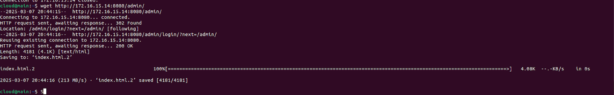

#### Criando um Túnel SSH para Acesso Externo

Para acessar o serviço no seu navegador:

1. Desconecte do SSH do MaaS com o comando `exit`

2. Reconecte criando um túnel SSH:
   ```bash
   ssh cloud@10.103.1.22 -L 8001:172.16.15.7:8080
   ```
   
   Este comando cria um túnel do serviço do server2 na porta 8080 para o seu localhost na porta 8001.

3. Acesse no navegador: `http://localhost:8001/admin/`
   - Login Django: `cloud`
   - Senha Django: `cloud`

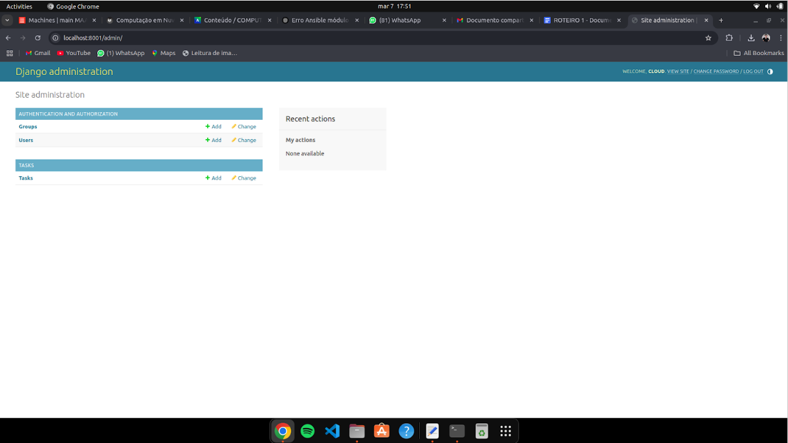

Um túnel SSH é uma conexão segura que permite redirecionar dados de uma máquina remota para sua máquina local. Ele funciona como um "canal secreto" criptografado, protegendo a comunicação contra interceptações.

!!!Tarefa-2
    
    De um print das Telas abaixo:
    
        1. Do Dashboard do **MAAS** com as máquinas.
        2. Da aba images, com as imagens sincronizadas.
        3. Da Aba de cada maquina(5x) mostrando os testes de hardware e commissioning com Status "OK"

##### 1. Do Dashboard do **MAAS** com as máquinas.
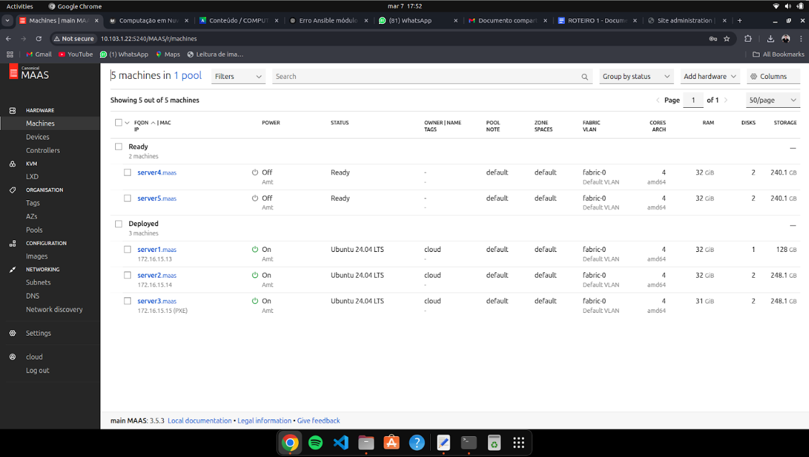

##### 2. Da aba images, com as imagens sincronizadas.
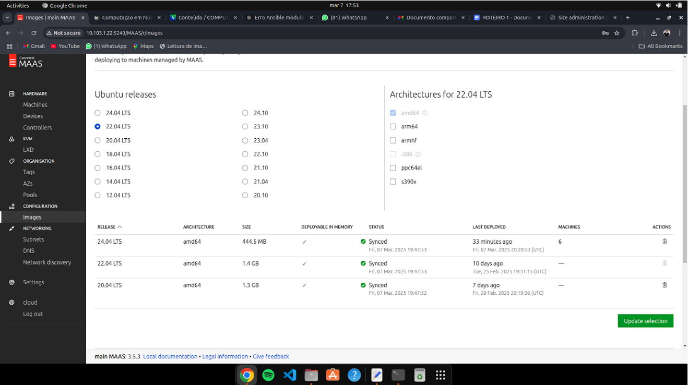

##### 3. Da Aba de cada maquina(5x) mostrando os testes de hardware e commissioning com Status "OK"

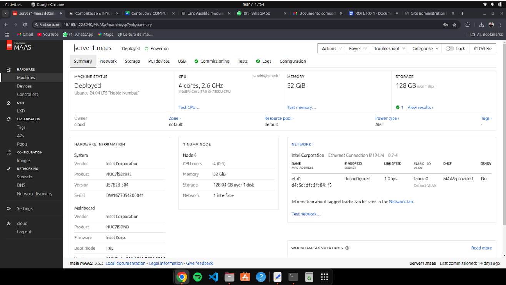


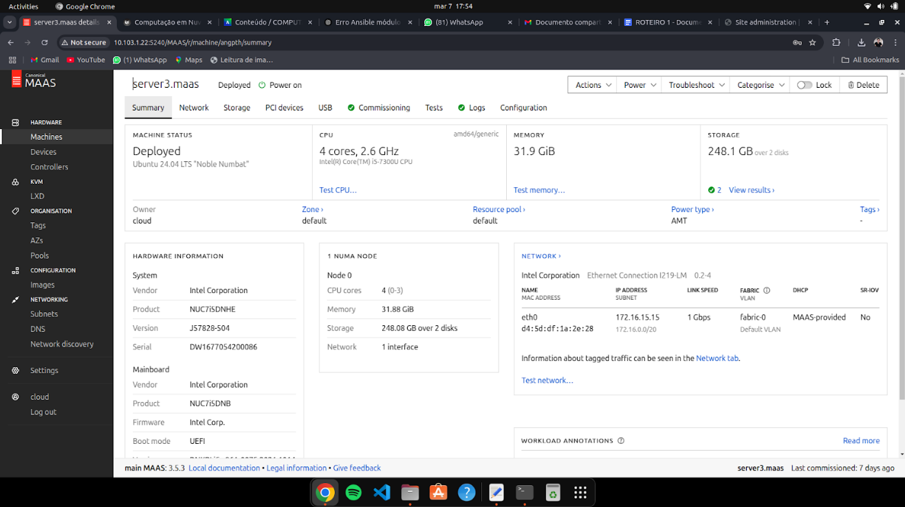


### Implantação Automatizada com Ansible

Para aumentar a disponibilidade da aplicação, vamos implementar uma segunda instância da aplicação Django:

1. Faça o deploy do Ubuntu 22.04 no server3 via dashboard do MaaS

2. No SSH do main, instale o Ansible:
   ```bash
   sudo apt install ansible
   wget https://raw.githubusercontent.com/raulikeda/tasks/master/tasks-install-playbook.yaml
   ```

3. Execute o playbook do Ansible:
   ```bash
   ansible-playbook tasks-install-playbook.yaml --extra-vars server=172.16.15.15  # IP do server3
   ```

A diferença entre a instalação manual e com Ansible é que manualmente precisamos pedir uma máquina ao MaaS, solicitar uma reserva, deployar e instalar via script, o que é trabalhoso e não automatizado. Com o Ansible, realizamos a instalação de forma automática, pois ele já é um gerenciador de deploy - basta fornecer o arquivo YAML com os requisitos.

### Balanceamento de Carga com Proxy Reverso

Para criar um ponto único de entrada e distribuir a carga entre os servidores, vamos implementar um proxy reverso com Nginx:

1. Faça o deploy do Ubuntu no server4 via dashboard do MaaS

2. Acesse o server4 via SSH e instale o Nginx:
   ```bash
   sudo apt-get update
   sudo apt-get install nginx
   ```

3. Configure o módulo upstream:
   ```bash
   sudo nano /etc/nginx/sites-available/default
   ```

4. Adicione a configuração de balanceamento de carga:
   ```nginx
   upstream backend {
       server 172.16.15.7:8080;  # IP do server2
       server 172.16.15.15:8080; # IP do server3
   }

   server {
       location / {
           proxy_pass http://backend;
       }
   }
   ```

5. Reinicie o Nginx:
   ```bash
   sudo service nginx restart
   ```

6. Modifique a mensagem de cada servidor Django para identificação:
   - Edite o arquivo `tasks/views.py` em cada servidor:
   ```bash
   nano tasks/views.py
   ```
   - Altere a mensagem para incluir o nome do servidor:
   ```python
   from django.shortcuts import render
   from django.http import HttpResponse

   def index(request):
       return HttpResponse("Hello, world. You're at the tasks index (on server2).")  # ou server3
   ```

7. Edite o arquivo `urls.py` para customizar o path:
   ```python
   urlpatterns = [path('', views.index, name='index'),]
   ```

8. Teste o acesso ao proxy reverso, verificando que ele alterna entre os servidores.

!!! Tarefa-5

    Teste o acesso, caso esteja tudo certo, faça a tarefa abaixo:

        1. De um print da tela do Dashboard do MAAS com as 4 Maquinas e seus respectivos IPs.
        2. Altere o conteúdo da mensagem contida na função `index` do arquivo `tasks/views.py` de cada server para distinguir ambos os servers. 
        3. Faça um `GET request` para o path que voce criou em urls.py para o Nginx e tire 2 prints das respostas de cada request, provando que voce está conectado ao server 4, que é o Proxy Reverso e que ele bate cada vez em um server diferente server2 e server3.  

##### 1. De um print da tela do Dashboard do MAAS com as 4 Maquinas e seus respectivos IPs.


##### 2. Altere o conteúdo da mensagem contida na função `index` do arquivo `tasks/views.py` de cada server para distinguir ambos os servers.
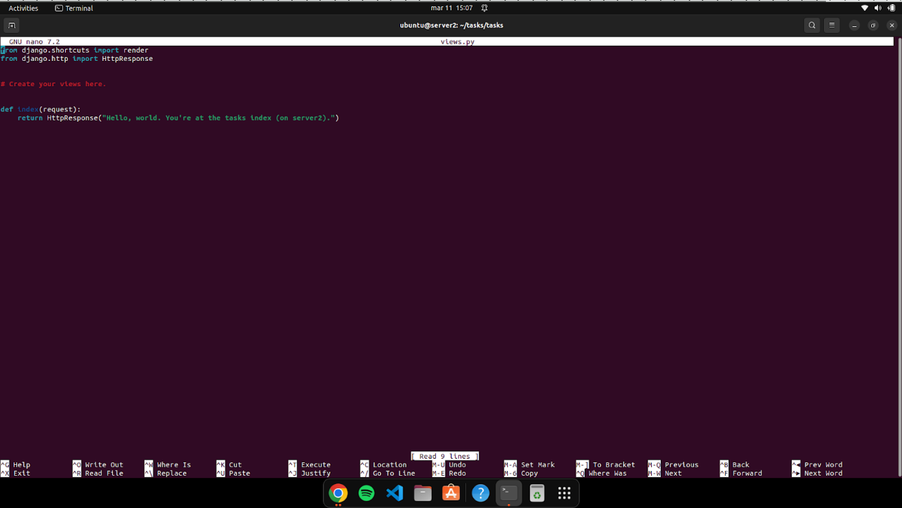
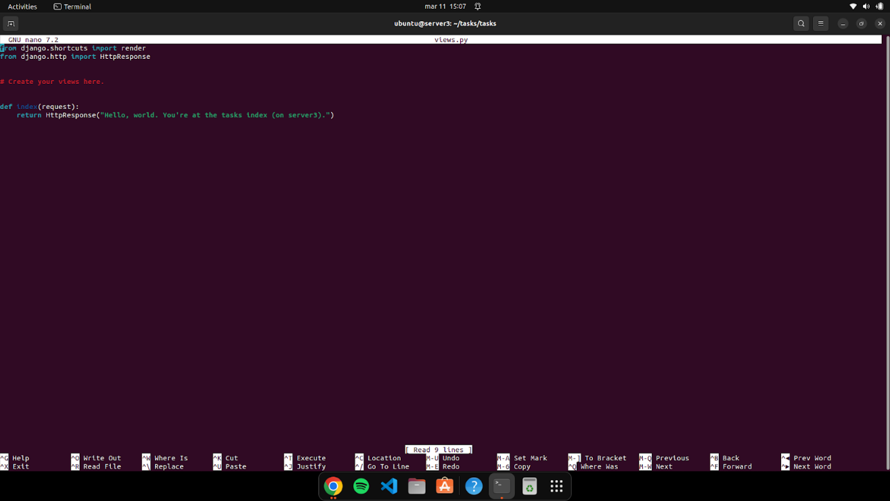

##### 3. Faça um `GET request` para o path que voce criou em urls.py para o Nginx e tire 2 prints das respostas de cada request, provando que voce está conectado ao server 4, que é o Proxy Reverso e que ele bate cada vez em um server diferente server2 e server3.
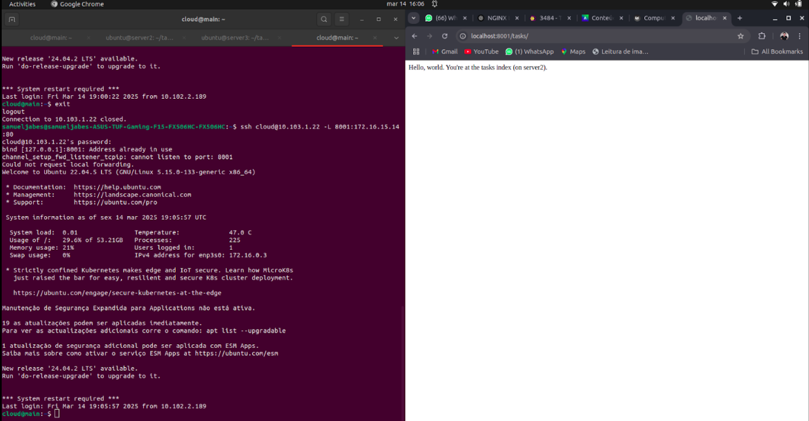
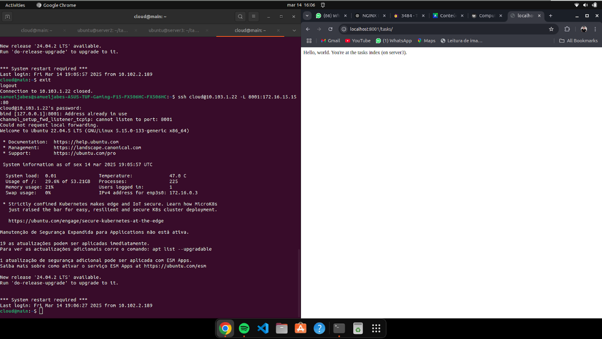

## Conclusão

Neste roteiro, configuramos com sucesso:

1. Um controlador MaaS para gerenciar nossa infraestrutura bare-metal
2. Uma rede com DHCP controlado pelo MaaS
3. Um servidor de banco de dados PostgreSQL
4. Duas instâncias de uma aplicação Django
5. Um balanceador de carga com Nginx para distribuir o tráfego
