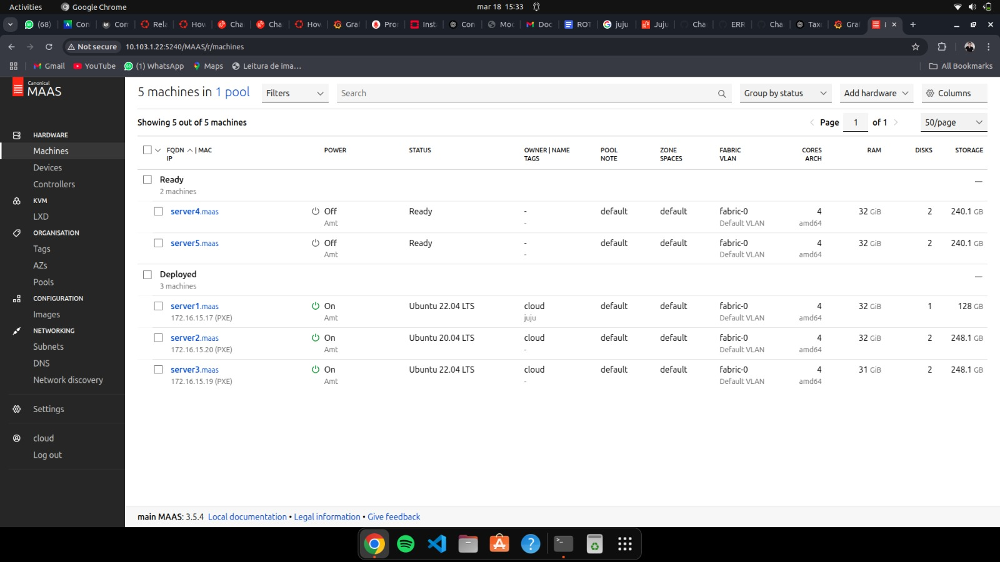
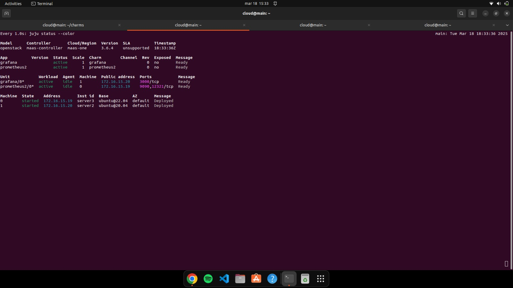
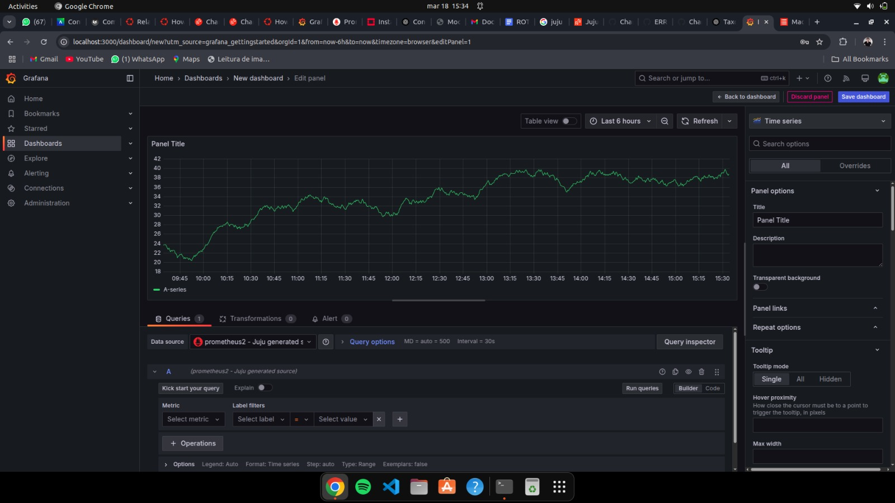
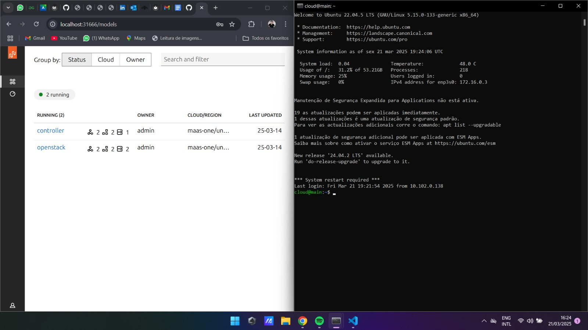
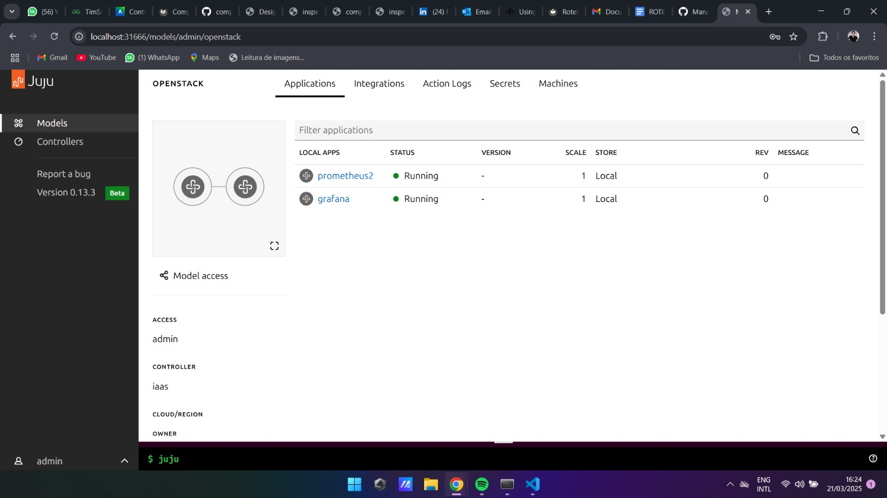

# Roteiro 2 - Juju

## Deployment Orchestration

### Criando infraestrutura para deploy com Juju

O **Ansible** é eficaz para gerenciar instalação e configuração de nós já provisionados, mas não realiza provisionamento direto com o **MAAS** (gerenciador de Bare Metal). Para montar nossa Cloud Privada, vamos utilizar o **Juju**, que se integra diretamente com o MAAS.

#### Pré-requisitos

- Verifique se todas as máquinas (server1, server2, server3, server4 e server5) estão com status **Ready** no MAAS.
- Faça o *release* das máquinas utilizadas anteriormente com Django e Postgres, se necessário.

#### Instalação do Juju

No nó principal (`main`), execute:

```bash
sudo snap install juju --channel 3.6
```

#### Verificação e Adição do MAAS como Provedor

Verifique se o MAAS já está listado como provedor:

```bash
juju clouds
```

Caso não esteja, crie o arquivo `maas-cloud.yaml` com a definição do provedor (verifique o endpoint do seu ambiente!):

```yaml
clouds:
  maas-one:
    type: maas
    auth-types: [oauth1]
    endpoint: http://192.168.0.3:5240/MAAS/
```

Adicione a cloud:

```bash
juju add-cloud --client -f maas-cloud.yaml maas-one
```

#### Adicionando credenciais MAAS

Crie o arquivo `maas-creds.yaml`:

```yaml
credentials:
  maas-one:
    anyuser:
      auth-type: oauth1
      maas-oauth: <API_KEY>
```

Substitua `<API_KEY>` pela sua chave de acesso do MAAS.

Adicione as credenciais:

```bash
juju add-credential --client -f maas-creds.yaml maas-one
```

#### Criando o modelo OpenStack

```bash
juju add-model --config default-series=jammy openstack
```

---

## Parte do App

### Utilizando a infraestrutura Bare Metal com o Juju

Vamos utilizar o Juju para fazer o deploy da seguinte arquitetura:

- **Grafana** com **Prometheus**

### Instalando o Dashboard do Juju

Instale o dashboard:

```bash
juju deploy juju-dashboard dashboard --to lxd:0
juju integrate dashboard controller
juju expose dashboard
juju dashboard
```

Saída esperada:

```
Dashboard for controller "maas-controller" is enabled at:
  http://localhost:31666
Your login credential is:
  username: admin
  password: <senha>
```

#### Acessando o dashboard remotamente

Faça um túnel SSH para acessar o dashboard a partir do seu navegador:

```bash
ssh cloud@10.103.1.22 -L 31666:172.16.15.18:8080
```

---

### Alternando entre modelos

Verifique os modelos existentes:

```bash
juju models
```

Mude para o modelo de aplicações:

```bash
juju switch openstack
```

Volte para o controlador:

```bash
juju switch maas-controller:admin/maas
```

---

## Deploy do Grafana e Prometheus

O **Grafana** é uma plataforma open-source para visualização de dados. Neste caso, ele será integrado ao **Prometheus**, que funcionará como seu banco de dados.

#### Baixando os charms

Crie uma pasta para os charms:

```bash
mkdir -p ~/charms
cd ~/charms
```

Baixe os charms:

```bash
juju download grafana
juju download prometheus2
```

#### Realizando o Deploy

```bash
juju deploy ./prometheus2_r60.charm
juju deploy ./grafana_r69.charm --base ubuntu@20.04
```

Acompanhe o status:

```bash
watch -n 1 --color "juju status --color"
```

---

## Integração do Grafana com Prometheus

Siga a documentação oficial do charm do Grafana para integração:

```bash
juju integrate grafana:grafana-source prometheus2:grafana-source
```

Acesse o dashboard do Grafana e verifique se o Prometheus está listado como source. Crie um dashboard com uma visualização para confirmar a integração.

---

## Tarefas

!!! Tarefa 1

    1. Print do Dashboard do MAAS com as máquinas e seus respectivos IPs.
    2. Print do comando `juju status` com o Grafana ativo.
    3. Print do Dashboard do Grafana mostrando o Prometheus como source.
    4. Prova (print) de acesso ao Dashboard via rede do Insper.
    5. Print da tela do Dashboard Juju com as aplicações em execução:  
    `http://<IP-Serviço>:8080/models/admin/maas`

#### 1. Print do Dashboard do MAAS com as máquinas e seus respectivos IPs.


#### 2. Print do comando `juju status` com o Grafana ativo.


#### 3. Print do Dashboard do Grafana mostrando o Prometheus como source


#### 4. Prova (print) de acesso ao Dashboard via rede do Insper.


#### 5. Print da tela do Dashboard Juju com as aplicações em execução: `http://<IP-Serviço>:8080/models/admin/maas`

---

## Limpeza de Ambiente

Execute os comandos abaixo para destruir o ambiente:

```bash
juju destroy-model openstack
juju destroy-controller maas-controller
```

**Em cada servidor:**

Navegue até `Network > Create Bridge` e configure com:

- Nome: `br-ex`
- Tipo: `OVS`
- VLAN: habilitado
- IP Mode: DHCP

