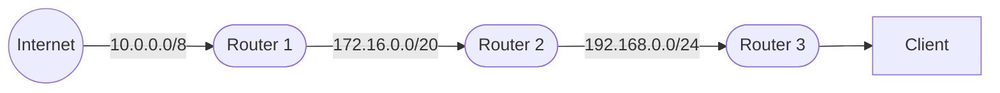

# Roteiro 3 - OpenStack

## Infra

### Criando a Infraestrutura (Nuvem VM) – Servidor Virtual Privado (VPS)

Nesse roteiro vamos instalar um conjunto de aplicações denominado **OpenStack** que vai permitir distribuirmos máquinas virtuais usando os nós disponíveis no kit.

Até o momento usamos o MAAS para orquestrar o bare metal e o Juju para cuidar do deployment de aplicações (por exemplo, Grafana e Prometheus). Agora, vamos utilizar o OpenStack para criar VMs e distribuir os serviços em todas as máquinas do kit com maior eficiência.

**Atenção**

Confira se os seus recursos físicos seguem, no **MÍNIMO**, a tabela abaixo. Volte ao dashboard do MAAS e crie as Tags conforme descrito:

| Node name  | Tag(s)     | CPUs | NICs | RAM (GB) | Disks | Storage (GB) |
|------------|------------|------|------|----------|-------|--------------|
| node1.maas | controller | 2    | 1    | 12.0     | 1     | 80.0         |
| node2.maas | reserva    | 2    | 1    | 16.0     | 2     | 80.0         |
| node3.maas | compute    | 2    | 1    | 32.0     | 2     | 80.0         |
| node4.maas | compute    | 2    | 1    | 32.0     | 2     | 80.0         |
| node5.maas | compute    | 2    | 1    | 32.0     | 2     | 80.0         |

Antes de começar a instalação do OpenStack, verifique se o MAAS está configurado corretamente (Bridges, Subnets, Tags etc).

#### Bridge no MAAS

Verifique se o `br-ex` está configurado corretamente no MAAS. O `br-ex` é a interface de rede que conecta o OpenStack à rede externa. Se não estiver configurado corretamente, o OpenStack não conseguirá se comunicar com o mundo exterior.

1. Acesse o painel do MAAS e vá para a seção de redes.  
2. Verifique se o `br-ex` está listado e conectado à rede correta.  
3. Caso contrário, configure-o antes de prosseguir.

**O `br-ex` deve estar configurado para todos os nós.**

#### Implantação do OpenStack

“Siga” o passo a passo do guia oficial, porém **não instale nada** no **server2** (reservado). Altere os comandos para que:

- **server1** seja o *controller*  
- **server2** seja a *reserva*  
- **server3**, **server4** e **server5** sejam *compute*

> Execute um comando por vez e aguarde a conclusão antes de prosseguir:  
> ```bash
> juju status
> ```

Esse roteiro foi adaptado ao nosso ambiente. Estude o guia oficial antes de começar:

- Documentação oficial: [Instalação do OpenStack com Juju](https://docs.openstack.org/project-deploy-guide/charm-deployment-guide/latest/install-openstack.html)

#### Juju Controller

> **Atenção:** apenas se ainda não existir um Juju Controller instalado.  
> Adicione a tag `controller` na máquina **server1** e execute:
```bash
juju bootstrap --bootstrap-series=jammy --constraints tags=controller maas-one maas-controller
```

#### Definindo o modelo de deploy

```bash
juju add-model --config default-series=jammy openstack
juju switch maas-controller:openstack
```

**Opcional:** instalar o dashboard do Juju:
[Manage the Juju Dashboard](https://canonical-juju.readthedocs-hosted.com/en/latest/user/howto/manage-the-juju-dashboard/#manage-the-juju-dashboard)

#### Monitoramento

Abra um novo terminal e rode:

```bash
watch -n 2 --color "juju status --color"
```

o status será atualizado a cada 2 segundos.

---

### Roteiro Atualizado de Instalação do OpenStack

Em caso de problemas, consulte primeiro a documentação oficial.

1. **Instalando o Juju Controller**

    > **Atenção:** somente se ainda não existir um controlador.

    ```bash
    juju bootstrap --bootstrap-series=jammy --constraints tags=controller maas-one maas-controller
    ```

2. **Definindo o modelo de deploy**

    ```bash
    juju add-model --config default-series=jammy openstack
    juju switch maas-controller:openstack
    ```

3. **Ceph OSD**
    Implanta 3 unidades do `ceph-osd`.
    **ceph-osd.yaml**:
 
    ```yaml
    ceph-osd:
      osd-devices: /dev/sda /dev/sdb
    ```
 
    ```bash
    juju deploy -n 3 --channel quincy/stable --config ceph-osd.yaml --constraints tags=compute ceph-osd
    ```

   > **Nota:** se aparecer “Non-pristine devices detected”, use as ações `zap-disk` e `add-disk`.

4. **Nova Compute**
   **nova-compute.yaml**:

    ```yaml
    nova-compute:
      config-flags: default_ephemeral_format=ext4
      enable-live-migration: true
      enable-resize: true
      migration-auth-type: ssh
      virt-type: qemu
    ```

    ```bash
    juju deploy -n 3 --to 0,1,2 --channel yoga/stable --config nova-compute.yaml nova-compute
    ```

5. **MySQL InnoDB Cluster**

    ```bash
    juju deploy -n 3 --to lxd:0,lxd:1,lxd:2 --channel 8.0/stable mysql-innodb-cluster
    ```

6. **Vault**

    ```bash
    juju deploy --to lxd:2 vault --channel 1.8/stable
    juju deploy --channel 8.0/stable mysql-router vault-mysql-router
    juju integrate vault-mysql-router:db-router mysql-innodb-cluster:db-router
    juju integrate vault-mysql-router:shared-db vault:shared-db
    ```

   * Inicialize e **unseal** (veja a documentação do charm).
   * Gere a CA autoassinada:

     ```bash
     juju run vault/leader generate-root-ca
     ```

   * Integre certificados:

     ```bash
     juju integrate mysql-innodb-cluster:certificates vault:certificates
     ```

7. **Neutron Networking**
   **neutron.yaml**:

    ```yaml
    ovn-chassis:
      bridge-interface-mappings: br-ex:eth0
      ovn-bridge-mappings: physnet1:br-ex
    neutron-api:
      neutron-security-groups: true
      flat-network-providers: physnet1
    ```

    ```bash
    juju deploy -n 3 --to lxd:0,lxd:1,lxd:2 --channel 22.03/stable ovn-central
    juju deploy --to lxd:1 --channel yoga/stable --config neutron.yaml neutron-api
    juju deploy --channel yoga/stable neutron-api-plugin-ovn
    juju deploy --channel 22.03/stable --config neutron.yaml ovn-chassis
 
    juju integrate neutron-api-plugin-ovn:neutron-plugin neutron-api:neutron-plugin-api-subordinate
    juju integrate neutron-api-plugin-ovn:ovsdb-cms ovn-central:ovsdb-cms
    juju integrate ovn-chassis:ovsdb ovn-central:ovsdb
    juju integrate ovn-chassis:nova-compute nova-compute:neutron-plugin
    juju integrate neutron-api:certificates vault:certificates
    juju integrate neutron-api-plugin-ovn:certificates vault:certificates
    juju integrate ovn-central:certificates vault:certificates
    juju integrate ovn-chassis:certificates vault:certificates
    ```

8. **Keystone**

    ```bash
    juju deploy --to lxd:0 --channel yoga/stable keystone
    juju deploy --channel 8.0/stable mysql-router keystone-mysql-router
    juju integrate keystone-mysql-router:db-router mysql-innodb-cluster:db-router
    juju integrate keystone-mysql-router:shared-db keystone:shared-db
    juju integrate keystone:identity-service neutron-api:identity-service
    juju integrate keystone:certificates vault:certificates
    ```

9. **RabbitMQ**

    ```bash
    juju deploy --to lxd:2 --channel 3.9/stable rabbitmq-server
    juju integrate rabbitmq-server:amqp neutron-api:amqp
    juju integrate rabbitmq-server:amqp nova-compute:amqp
    ```

10. **Nova Cloud Controller**
    **ncc.yaml**:

    ```yaml
    nova-cloud-controller:
      network-manager: Neutron
    ```

    ```bash
    juju deploy --to lxd:2 --channel yoga/stable --config ncc.yaml nova-cloud-controller
    juju deploy --channel 8.0/stable mysql-router ncc-mysql-router
    juju integrate ncc-mysql-router:db-router mysql-innodb-cluster:db-router
    juju integrate ncc-mysql-router:shared-db nova-cloud-controller:shared-db

    juju integrate nova-cloud-controller:identity-service keystone:identity-service
    juju integrate nova-cloud-controller:amqp rabbitmq-server:amqp
    juju integrate nova-cloud-controller:neutron-api neutron-api:neutron-api
    juju integrate nova-cloud-controller:cloud-compute nova-compute:cloud-compute
    juju integrate nova-cloud-controller:certificates vault:certificates
    ```

11. **Placement**

    ```bash
    juju deploy --to lxd:2 --channel yoga/stable placement
    juju deploy --channel 8.0/stable mysql-router placement-mysql-router
    juju integrate placement-mysql-router:db-router mysql-innodb-cluster:db-router
    juju integrate placement-mysql-router:shared-db placement:shared-db
    juju integrate placement:identity-service keystone:identity-service
    juju integrate placement:placement nova-cloud-controller:placement
    juju integrate placement:certificates vault:certificates
    ```

12. **Horizon – OpenStack Dashboard**

    ```bash
    juju deploy --to lxd:2 --channel yoga/stable openstack-dashboard
    juju deploy --channel 8.0/stable mysql-router dashboard-mysql-router
    juju integrate dashboard-mysql-router:db-router mysql-innodb-cluster:db-router
    juju integrate dashboard-mysql-router:shared-db openstack-dashboard:shared-db
    juju integrate openstack-dashboard:identity-service keystone:identity-service
    juju integrate openstack-dashboard:certificates vault:certificates
    ```

13. **Glance**

    ```bash
    juju deploy --to lxd:2 --channel yoga/stable glance
    juju deploy --channel 8.0/stable mysql-router glance-mysql-router
    juju integrate glance-mysql-router:db-router mysql-innodb-cluster:db-router
    juju integrate glance-mysql-router:shared-db glance:shared-db
    juju integrate glance:image-service nova-cloud-controller:image-service
    juju integrate glance:image-service nova-compute:image-service
    juju integrate glance:identity-service keystone:identity-service
    juju integrate glance:certificates vault:certificates
    ```

14. **Ceph Monitor**
    **ceph-mon.yaml**:

    ```yaml
    ceph-mon:
      expected-osd-count: 3
      monitor-count: 3
    ```

    ```bash
    juju deploy -n 3 --to lxd:0,lxd:1,lxd:2 --channel quincy/stable --config ceph-mon.yaml ceph-mon
    juju integrate ceph-mon:osd ceph-osd:mon
    juju integrate ceph-mon:client nova-compute:ceph
    juju integrate ceph-mon:client glance:ceph
    ```

15. **Cinder**
    **cinder.yaml**:

    ```yaml
    cinder:
      block-device: None
      glance-api-version: 2
    ```

    ```bash
    juju deploy --to lxd:1 --channel yoga/stable --config cinder.yaml cinder
    juju deploy --channel 8.0/stable mysql-router cinder-mysql-router
    juju integrate cinder-mysql-router:db-router mysql-innodb-cluster:db-router
    juju integrate cinder-mysql-router:shared-db cinder:shared-db
    juju integrate cinder:cinder-volume-service nova-cloud-controller:cinder-volume-service
    juju integrate cinder:identity-service keystone:identity-service
    juju integrate cinder:amqp rabbitmq-server:amqp
    juju integrate cinder:image-service glance:image-service
    juju integrate cinder:certificates vault:certificates

    juju deploy --channel yoga/stable cinder-ceph
    juju integrate cinder-ceph:storage-backend cinder:storage-backend
    juju integrate cinder-ceph:ceph ceph-mon:client
    juju integrate cinder-ceph:ceph-access nova-compute:ceph-access
    ```

16. **Ceph RADOS Gateway**

    ```bash
    juju deploy --to lxd:0 --channel quincy/stable ceph-radosgw
    juju integrate ceph-radosgw:mon ceph-mon:radosgw
    ```

17. **Ceph‑OSD Integration**

    ```bash
    juju config ceph-osd osd-devices='/dev/sdb'
    ```

### Resultados finais e próximos passos

Depois que todos os aplicativos foram implantados e as relações adicionadas, aguarde até o `juju status` estabilizar, sem mensagens de erro. Exemplo de saída:
[https://docs.openstack.org/project-deploy-guide/charm-deployment-guide/latest/install-openstack-juju-status.html#install-openstack-juju-status](https://docs.openstack.org/project-deploy-guide/charm-deployment-guide/latest/install-openstack-juju-status.html#install-openstack-juju-status)

Você implantou o OpenStack com sucesso usando Juju e MAAS. O próximo passo é tornar a nuvem funcional para os usuários, configurando redes, imagens e ambientes de usuário.

**Info**

* Dica: [Git do Vault – Post‑Deployment Tasks](https://opendev.org/openstack/charm-vault/src/branch/stable/1.8/src/README.md#post-deployment-tasks)
* Instalar CLI do Vault:

  ```bash
  sudo snap install vault
  export VAULT_ADDR="http://<IP do Vault>:8200"
  vault operator init --key-shares=5 --key-threshold=3
  ```

  Copie as **5 Unseal Keys** e o **Initial Root Token**.

  ```bash
  vault operator unseal <Unseal Key>  # repita 3x com chaves diferentes
  ```

  Autorize o charm (dentro de 50 minutos):

  ```bash
  export VAULT_TOKEN=<Initial Root Token>
  vault token create --ttl=50m
  juju run vault/leader authorize-charm token=<token>
  ```

---

## Setup

### Configurando o OpenStack

**Documentação:** [Configurar OpenStack](https://docs.openstack.org/project-deploy-guide/charm-deployment-guide/latest/configure-openstack.html)

Agora vamos configurar:

* VMs (**Nova**)
* Volumes de disco (**Cinder**)
* Rede virtual (**Neutron**)

1. Carregar variáveis de ambiente e autenticar (Keystone) via `openrc`.
2. Usar o Horizon para visualizar mudanças.
3. Importar imagem do Ubuntu Jammy para o Glance.
4. Criar flavors.
5. Criar rede externa.
6. Criar rede interna e roteador.

> **Atenção:** execute TODOS OS COMANDOS no terminal `main` ou no Horizon. **Não** nos NUCs!

#### Passo 1: Autenticação

Faça o download ou crie o arquivo `openrc` com suas credenciais do OpenStack (variáveis como `OS_AUTH_URL`, `OS_USERNAME` etc).

#### Passo 2: Horizon

Acesse o Horizon como admin e mantenha aberto durante todo o setup.

> **Dica:** Domain name = `admin_domain`

#### Passo 3: Imagens e Flavors

Instale o cliente OpenStack no `main`:

```bash
sudo snap install openstack-client --classic
source openrc
```

Verifique serviços:

```bash
openstack service list
```

Ajuste rede:

```bash
juju config neutron-api enable-ml2-dns="true"
juju config neutron-api-plugin-ovn dns-servers="172.16.0.1"
```

Importe a imagem do Ubuntu Jammy (consulte a URL na doc oficial):

```bash
openstack image create "Ubuntu Jammy" \
  --file ubuntu-22.04-server-cloudimg-amd64.img \
  --disk-format qcow2 \
  --container-format bare \
  --public
```

Crie os flavors:

| Flavor Name | vCPUs | RAM (GB) | Disk (GB) |
| ----------- | ----- | -------- | --------- |
| m1.tiny     | 1     | 1        | 20        |
| m1.small    | 1     | 2        | 20        |
| m1.medium   | 2     | 4        | 20        |
| m1.large    | 4     | 8        | 20        |

#### Passo 4: Rede Externa

Crie uma rede externa com faixa de alocação entre `172.16.7.0/24` e `172.16.8.255`.

#### Passo 5: Rede Interna e Roteador

Use a subnet `192.169.0.0/24` (sem DNS) e configure o roteador.

#### Passo 6: Instância

1. Crie um key-pair:

   ```bash
   openstack keypair create --public-key ~/.ssh/id_rsa.pub mykey
   ```
2. Lance instância `m1.tiny` chamada `client`:

   ```bash
   openstack server create \
     --flavor m1.tiny \
     --image "Ubuntu Jammy" \
     --key-name mykey \
     --network private-net client
   ```
3. Aloque floating IP:

   ```bash
   openstack floating ip create external-net
   openstack server add floating ip client <FLOATING_IP>
   ```
4. Teste SSH.

#### Escalando os nós

1. Libere a máquina ALLOCATED no MAAS.
2. Adicione hypervisor:

   ```bash
   juju add-unit nova-compute
   ```
3. Adicione block storage:

   ```bash
   juju add-unit --to <machine-id> ceph-osd
   ```

### Tarefas

#### Tarefa 1

#### 1. Print do Status do JUJU


#### 2. Print do Dashboard do MAAS com as máquinas


#### 3. Print da aba *Compute Overview* no OpenStack Dashboard


#### 4. Print da aba *Compute Instances* no OpenStack Dashboard


#### 5. Print da aba *Network Topology* no OpenStack Dashboard


#### Tarefa 2

#### 1. Print do Dashboard do MAAS com as máquinas


#### 2. Print da aba *Compute Overview* no OpenStack Dashboard


#### 3. Print da aba *Compute Instances* no OpenStack Dashboard


#### 4. Print da aba *Network Topology* no OpenStack Dashboard


1. Enumere as diferenças entre os prints da Tarefa 1 e da Tarefa 2 e explique como cada recurso foi criado

A diferença se deve devido a criação de uma nova instância a partir de uma nova imagem (um flavor de tamanho **tiny**) e à definição de uma rede externa e interna, com a instância criada ligada à rede interna.


#### Tarefa 3

A arquitetura de rede é algo como:




---

## App

### Uso da Infraestrutura

Levante as aplicações em VMs do OpenStack:

* 2 instâncias com a API do projeto  
* 1 instância com banco de dados  
* 1 instância com Load Balancer (Nginx)

**Topologia de rede:**

```
Interna: 192.169.0.0/24
└─ Load Balancer (Nginx)
├─ API (2 instâncias)
└─ Banco de Dados
Externa: 172.16.0.0/20
```


**Atenção:** escolha o menor flavor que atenda ao desempenho; em clouds comerciais, o custo é proporcional ao tamanho do flavor e ao tempo de uso.

#### Passos de implantação

1. **Criação das instâncias**  
     ```bash
     # API (primeiro modelo)
     openstack server create \
       --image jammy-amd64 \
       --flavor m1.tiny \
       --key-name chave \
       --network user1_net \
       --security-group Allow_SSH \
       api-1
 
     # API (segundo modelo)
     openstack server create \
       --image jammy-amd64 \
       --flavor m1.tiny \
       --key-name chave \
       --network user1_net \
       --security-group Allow_SSH \
       api-2
 
     # Banco de Dados
     openstack server create \
       --image jammy-amd64 \
       --flavor m1.tiny \
       --key-name chave \
       --network user1_net \
       --security-group Allow_SSH \
       database
     ```

2. **Reserva e associação de Floating IP**

    ```bash
    FLOATING_IP=$(openstack floating ip create \
      -f value -c floating_ip_address ext_net)
 
    openstack server add floating ip api-1   $FLOATING_IP
    openstack server add floating ip api-2   $FLOATING_IP
    openstack server add floating ip database $FLOATING_IP
 
    openstack server list
    ```

3. **Configuração do Load Balancer (Nginx)**

    ```bash
    sudo apt update && sudo apt install nginx -y
    sudo nano /etc/nginx/sites-available/default
    sudo systemctl restart nginx
    sudo systemctl status nginx
    ```

4. **Deploy da API via Docker**

    ```bash
    sudo docker pull samueljabes/simple_authentication_api:v1.0.1
 
    sudo docker run -d -p 5000:5000 \
      -e POSTGRES_USER=postgres \
      -e POSTGRES_PASSWORD=sjcc9494 \
      -e POSTGRES_DB=cloud-auth \
      -e POSTGRES_HOST=172.16.8.99 \
      -e POSTGRES_PORT=5432 \
      samueljabes/simple_authentication_api:v1.0.1
 
    sudo docker ps
    sudo docker logs $(sudo docker ps -q --filter ancestor=samueljabes/simple_authentication_api:v1.0.1)
    ```

5. **Preparação do banco de dados**

    ```bash
    # 1. Cria usuário e base
    sudo -u postgres psql <<EOF
    CREATE USER postgres WITH PASSWORD 'sjcc9494';
    CREATE DATABASE "cloud-auth" OWNER postgres;
    EOF
 
    # 2. Ajusta pg_hba.conf e reinicia
    sudo nano /etc/postgresql/14/main/pg_hba.conf
    sudo systemctl restart postgresql
 
    # 3. Importa script de criação de tabelas
    psql -U postgres -d cloud-auth -f /tmp/users.sql
 
    # 4. Valida (lista tabelas)
    \dt
    ```

Assim, ao realizar o túnel para a instância onde o **Load Balancer** está instalado, nós conseguimos acessar a API com esse fluxo de infra criado com o OpenStack:

```bash
ssh cloud@10.103.1.22 -L 8001:172.16.7.141:80
```

Ao abrir `localhost:8001`, obtemos:


Então a arquitetura final é algo como:

``` mermaid
flowchart LR
    subgraph private [192.169.0.0/24]
        direction TB
        lb e2@==> api1[API]
        lb e3@==> api2[API]
        api1 e4@==> db
        api2 e5@==> db
    end
    user e1@==>|request<br>172.16.0.0/20| lb
    e1@{ animate: true }
    e2@{ animate: true }
    e3@{ animate: true }
    e4@{ animate: true }
    e5@{ animate: true }
    lb@{ shape: div-rect, label: "Load Balancer" }
    db@{ shape: cyl, label: "Database" }
    user@{ img: "https://insper.github.io/computacao-nuvem/assets/images/fontawesome-user-icon.png", constraint: "on", h: 60, label: "User" }
```
