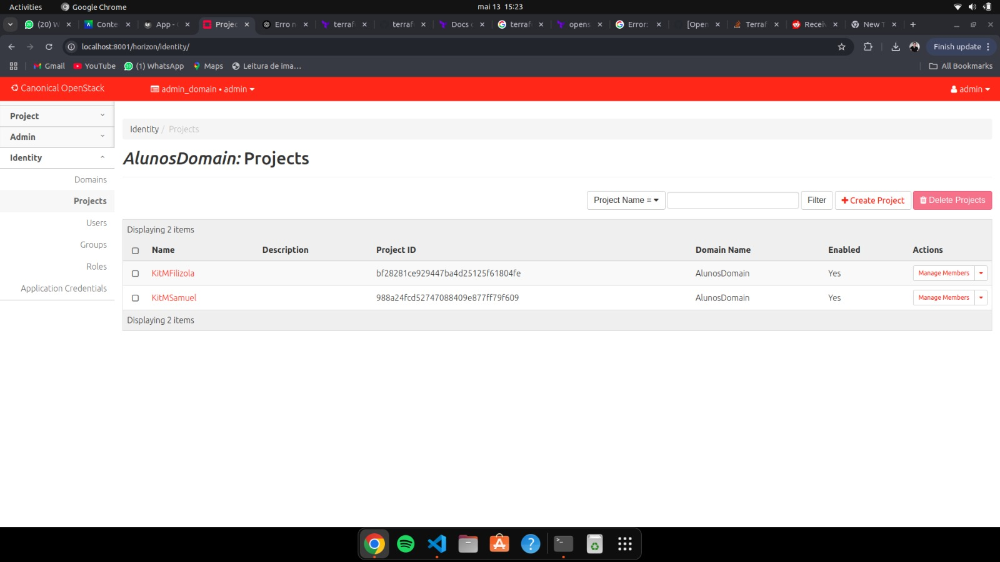
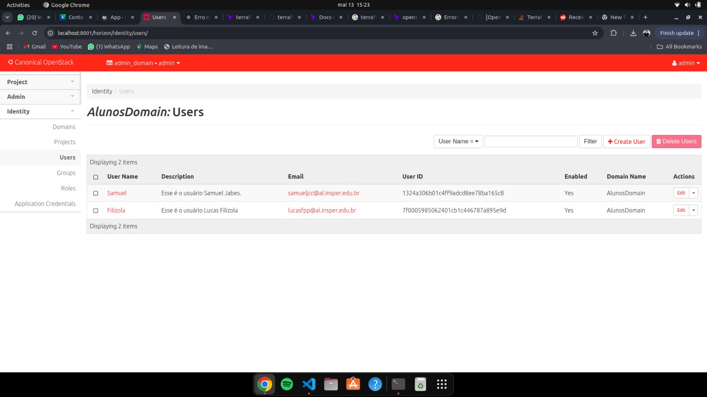
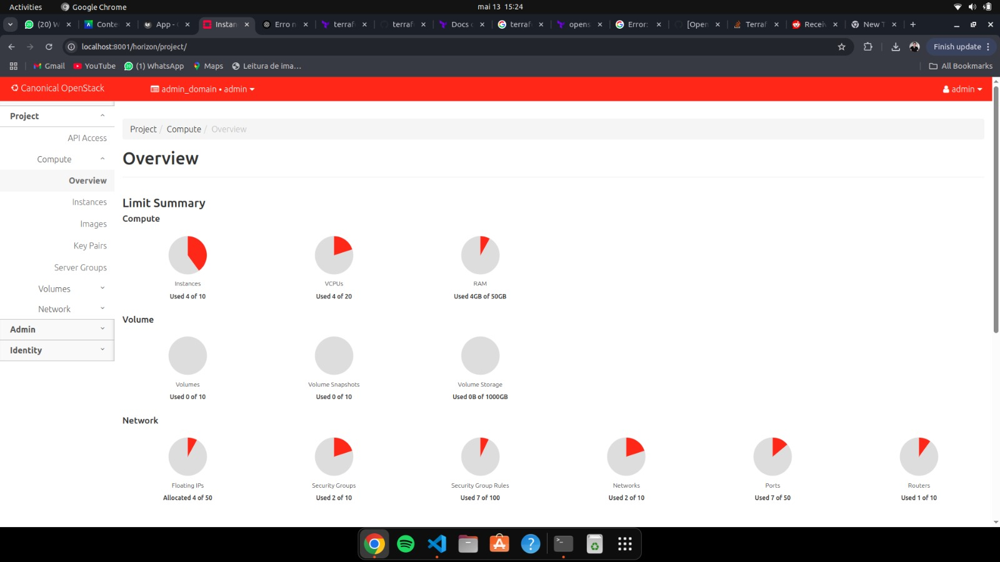
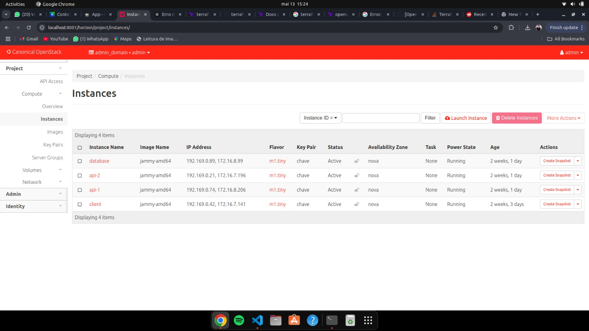
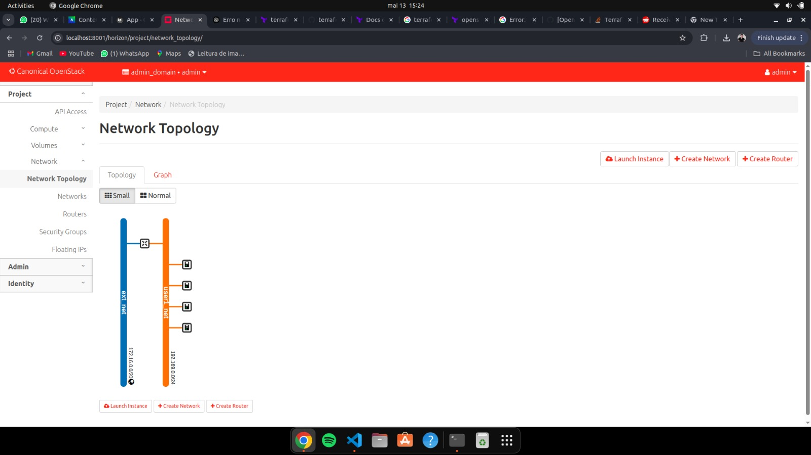

# Roteiro 4 – Identity e IaC

## Infra

### Criando a hierarquia de projetos separado por aluno

Agora vamos ver como funciona a separação lógica de recursos para cada usuário. Em vez de criar redes, sub-redes, VMs e roteadores manualmente no Horizon ou CLI, vamos organizar tudo dentro de um domínio com projetos e usuários distintos.


#### 1. Criar um Domain  
1. Acesse **Identity > Domains**.  
2. Clique em **Create Domain**.  
3. Preencha:  
   - **Name**: `AlunosDomain`  
   - **Description**: (opcional)  
4. Clique em **Create Domain**.

#### 2. Selecionar o novo Domain  
No canto superior direito do Horizon, escolha **AlunosDomain** como contexto de uso.

#### 3. Criar Projetos  
1. Acesse **Identity > Projects**.  
2. Clique em **Create Project** e preencha:  
   - **Name**: siga o padrão `kitX_nomeAluno` (ex.: `kitA_samuel`)  
   - **Description**: (opcional)  
   - **Quotas**: defina limites de CPU, RAM e disco se necessário.  
3. Clique em **Create Project**.  
4. Repita para cada aluno (por exemplo, `kitB_maria`).

#### 4. Criar Usuários  
1. Acesse **Identity > Users**.  
2. Clique em **Create User** e preencha:  
   - **Username**: `alunoX`  
   - **Email**: (opcional)  
   - **Password**: (escolha uma senha segura)  
   - **Domain**: `AlunosDomain`  
   - **Default Project**: o projeto respectivo (`kitX_nomeAluno`)  
3. Marque o papel **Admin** (ou outro papel necessário).  
4. Clique em **Create User**.  
5. Repita para cada usuário.

#### 5. Atribuir Papéis (se não feito acima)  
1. Acesse **Identity > Projects** e abra o projeto `kitX_nomeAluno`.  
2. Vá até a aba **Members** > **Manage Members**.  
3. Adicione o usuário `alunoX` e atribua-lhe o papel **Admin**.  
4. Clique em **Save**.

---

## App

### Criando a Infraestrutura utilizando IaC

Usaremos Terraform para automatizar a criação da rede, sub-rede, router e instâncias dentro de cada projeto. Cada aluno deve trabalhar em sua própria pasta, dentro do diretório **MAIN** do servidor. Abaixo, vamos exemplificar para o aluno **Samuel** e a organização é a mesma para o outro aluno.

#### 1. Estrutura de pastas

Dentro de `~/kitMSamuel/`:

```
kitMSamuel/
└─ terraform/
├ provider.tf
├ network.tf
├ router.tf
├ instance1.tf
└ instance2.tf
```

#### 2. provider.tf

```hcl
# Define required providers
terraform {
  required_version = ">= 0.14.0"
  required_providers {
    openstack = {
      source  = "terraform-provider-openstack/openstack"
      version = "~> 1.35.0"
    }
  }
}

# Configure the OpenStack Provider
provider "openstack" {
  user_name = "Samuel"
  password  = "sjcc9494"
  auth_url  = "https://172.16.15.29:5000/v3"
  region    = "RegionOne"
  insecure  = true
}
```

#### 3. network.tf

```hcl
resource "openstack_networking_network_v2" "network_sam_1" {
  name           = "network_sam_1"
  admin_state_up = "true"
}

resource "openstack_networking_subnet_v2" "subnet_2" {
  network_id = openstack_networking_network_v2.network_sam_1.id
  cidr       = "192.167.199.0/24"
}

```

> **⚠️ Observação:** é ideal que seja um nome único por aluno em todos os arquivos.

#### 4. router.tf

```hcl
resource "openstack_networking_router_v2" "router_2" {
  name                = "user1_router"
  admin_state_up      = true
  external_network_id = "8931ac52-d339-4ba6-abb2-ad48aa5a4858"
}

resource "openstack_networking_router_interface_v2" "int_2" {
  router_id = openstack_networking_router_v2.router_2.id
  subnet_id = openstack_networking_subnet_v2.subnet_2.id
}
```

#### 5. instance1.tf

```hcl
resource "openstack_compute_instance_v2" "my_instance_1_sam" {
  name      = "my_instance_1_sam"
  image_id  = "1caed021-f9d6-43c8-b455-187b620a19a6"
  flavor_id = "f5e13998-4362-416d-b29c-d3604cb51f4f"
  key_pair  = "chave_sam"

  network {
    name = "network_sam_1"
  }
}
```

#### 6. instance2.tf

```hcl
resource "openstack_compute_instance_v2" "my_instance_2_sam" {
  name      = "my_instance_2_sam"
  image_id  = "1caed021-f9d6-43c8-b455-187b620a19a6"
  flavor_id = "f5e13998-4362-416d-b29c-d3604cb51f4f"
  key_pair  = "chave_sam"

  network {
    name = "network_sam_1"
  }
}
```

#### 7. Credenciais do usuário

1. No Horizon, acesse **Project > API Access** e faça download do **OpenStack RC File**.
2. Copie o conteúdo do arquivo para `~/kitX_nomeAluno/seu_openrc.sh`.
3. Torne-o executável:

   ```bash
   chmod +x ~/kitX_nomeAluno/seu_openrc.sh
   ```
4. Carregue as variáveis de ambiente:

   ```bash
   source ~/kitX_nomeAluno/seu_openrc.sh
   ```

> Se ocorrer erro SSL, você pode:
>
> * `export OS_CACERT=/caminho/para/certificado.pem`
> * ou usar `export OS_VERIFY=False` (não recomendado em produção).

#### 8. Executando o Terraform

```bash
cd ~/kitX_nomeAluno/terraform
terraform init
terraform plan    # revisa o que será criado
terraform apply   # confirma e executa a criação
```

#### 9. Verificação

```bash
openstack network list
openstack subnet list
openstack router list
openstack server list
```

---

## Exercise CheckPoint

Para cada aluno, temos:

1. **Identity > Projects**

2. **Identity > Users**

3. **Compute > Overview**

4. **Compute > Instances**

5. **Network Topology**


---

## Criando um plano de Disaster Recovery e SLA

### QUESTÕES

1. Você é o CTO de uma empresa com várias capitais no Brasil e precisa implantar um sistema crítico, de baixo custo e com dados sigilosos.

    * Você escolheria Public Cloud ou Private Cloud? Por quê?

    Private Cloud, pois garante controle físico e lógico dos dados sigilosos, atendimento a normas de privacidade (LGPD), custos previsíveis (CapEx) e customização completa de segurança e rede.

2. Explique ao RH por que sua equipe precisa de um time de DevOps.

     Um time de DevOps funciona como uma ponte entre quem cria o software (desenvolvedores) e quem mantém tudo funcionando (operações). Em vez de fazer tudo “na mão” (configurar servidores, instalar atualizações, copiar arquivos), eles usam scripts e ferramentas que automatizam essas tarefas repetitivas. Isso traz três grandes benefícios:

     1. **Menos erros e mais rapidez**
     Ao automatizar a configuração de servidores e o deploy de novas versões, evitamos que alguém esqueça um passo ou digite algo errado. O resultado chega mais rápido e sem surpresas.

     2. **Ambientes sempre iguais**
     O que funciona no ambiente de testes vai funcionar em produção, porque as mesmas instruções automáticas são usadas em todos os lugares. Assim, não temos aquele “na minha máquina funcionou, mas no cliente não”.

     3. **Monitoramento e resposta imediata**
     O time de DevOps também instala ferramentas que ficam de olho no sistema 24 horas por dia. Se algo sair do normal, eles recebem um alerta e podem corrigir antes que o usuário perceba, mantendo nossos serviços estáveis.


3. Agora, planeje um ambiente resiliente para mitigar interrupções e indisponibilidades:

    Para mitigar falhas de hardware, interrupções de energia, ataques cibernéticos ou erros humanos, adotamos uma arquitetura multi‑zona com balanceadores de carga que fazem failover automático entre data centers. Runbooks documentados e exercícios de recuperação (drills) garantem que a equipe saiba exatamente o que fazer em cada cenário. A política de backup combina cópias incrementais diárias e snapshots completos semanais, todas criptografadas e armazenadas off‑site, com testes periódicos de restauração. Por fim, implementamos alta disponibilidade por meio de clusters de banco de dados e mensageria, armazenamento Ceph com réplica tripla e redes redundantes com health‑checks e alertas automáticos, assegurando continuidade dos serviços mesmo diante de incidentes.

